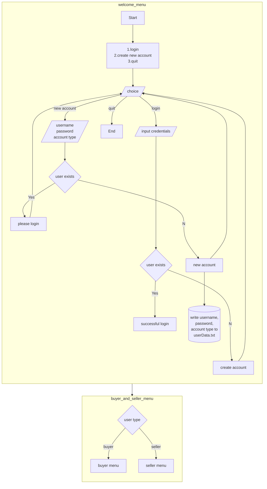

---
Marketplace
---
This flowchart outlines the logic for our Marketplace

```mermaid
flowchart TD
    subgraph welcome_menu
        direction TB
        A[Start]-->B[1.login\n2.create new account\n3.quit]
        B-->C[/choice/]
        C--login-->D[/input credentials/]
        D---->G{user exists}
        G--Yes-->H[successful login]
        G--No-->I[create account]
        I-->C
        
        C--new account-->E[/username\npassword\naccount type/]
        E-->J{user exists}
        J--Yes-->K[please login]
        K-->C
        J--No-->L[new account]
        L-->C
        L-->M[(write username,\npassword,\naccount type to\nuserData.txt)]
        
        C--quit-->F[End]
        end
    
    subgraph buyer_and_seller_menu
        direction TB
        O{user type}
        O--buyer-->P[buyer menu]
        O--seller-->Q[seller menu]
        
    end
    
    welcome_menu --> buyer_and_seller_menu

```
